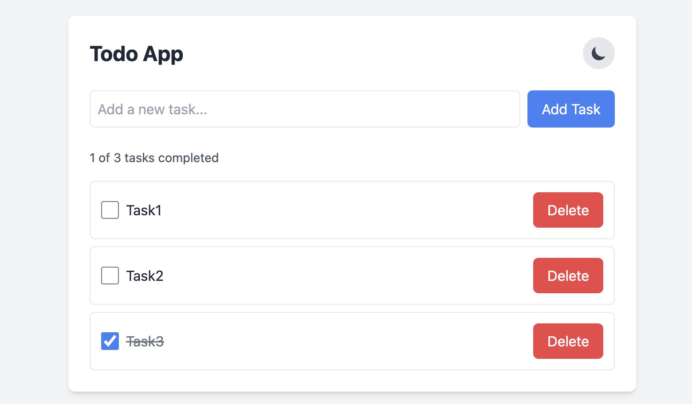
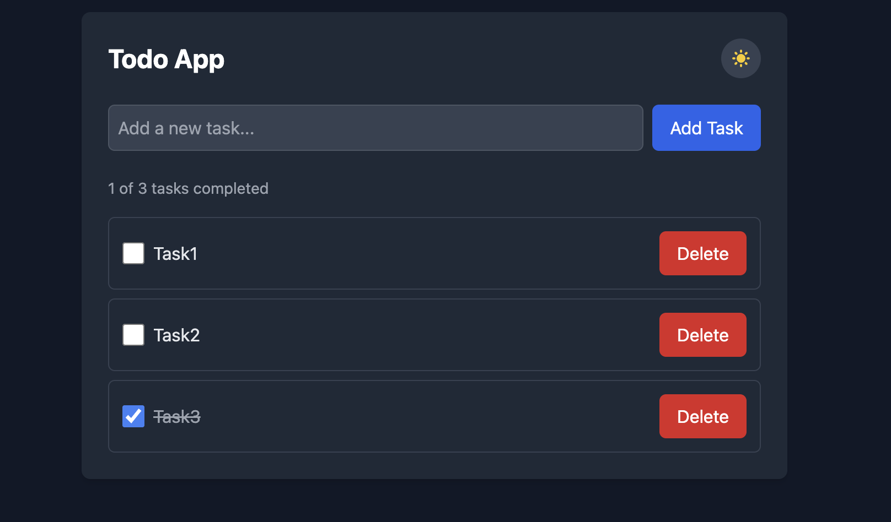

# React Todo App

A modern, responsive Todo application built with Vite, React, TypeScript, and Tailwind CSS.

## Features

- ✅ Add tasks with unique identifiers
- ✅ Mark tasks as completed
- ✅ Delete specific tasks (even if multiple tasks have the same name)
- ✅ Responsive design for all device sizes
- ✅ Dark mode toggle with system preference detection
- ✅ Persistent storage using localStorage
- ✅ Keyboard accessibility support
- ✅ Clean modern UI with Tailwind CSS

## Screenshots




## Technologies Used

- [Vite](https://vitejs.dev/) - Fast development server and build tool
- [React](https://reactjs.org/) - UI component library
- [TypeScript](https://www.typescriptlang.org/) - Type safety
- [Tailwind CSS](https://tailwindcss.com/) - Utility-first CSS framework
- [UUID](https://github.com/uuidjs/uuid) - Unique ID generation

## Project Structure

```
todo-app/
├── src/
│   ├── components/
│   │   ├── TaskForm.tsx
│   │   ├── TaskItem.tsx
│   │   ├── TaskList.tsx
│   │   ├── ThemeToggle.tsx
│   │   └── TodoApp.tsx
│   ├── types/
│   │   └── Task.ts
│   ├── App.tsx
│   ├── index.css
│   └── main.tsx
├── public/
├── index.html
├── package.json
├── tailwind.config.js
├── tsconfig.json
└── vite.config.ts
```

## Getting Started

### Prerequisites

- Node.js (version 14 or above)
- npm 

### Installation

1. Clone the repository:
   ```bash
   git clone https://github.com/Sonam060703/To-Do-App.git
   cd todo-app
   ```

2. Install dependencies:
   ```bash
   npm install
   ```

3. Start the development server:
   ```bash
   npm run dev
   ```

4. Open your browser and visit `http://localhost:5173`

### Build for Production

```bash
npm run build
```

The build output will be in the `dist` directory.

## Project Implementation Details

### Task Management

- Tasks are stored as an array of objects with the following structure:
  ```typescript
  interface Task {
    id: string;    // Unique identifier (UUID)
    name: string;  // Task name
    completed: boolean; // Status flag
  }
  ```

- When a task is added, it's assigned a unique ID via the UUID library
- When a task is deleted, only the task with the matching ID is removed
- Tasks are saved to localStorage for persistence between sessions

### Component Breakdown

- **TodoApp**: Main container component that manages state and integrates all sub-components
- **TaskForm**: Handles task input and submission
- **TaskList**: Renders the list of tasks
- **TaskItem**: Displays individual task with controls for toggle and delete
- **ThemeToggle**: Manages dark/light mode preference

### Styling

- Tailwind CSS provides utility classes for responsive design
- Custom component classes for buttons and other UI elements
- Dark mode support with system preference detection

## Accessibility Features

- Proper keyboard navigation
- Focus states for interactive elements
- ARIA labels for better screen reader support
- Sufficient color contrast in both light and dark modes


## Acknowledgments

- [Tailwind CSS](https://tailwindcss.com/)
- [Vite](https://vitejs.dev/)
- [React](https://reactjs.org/)